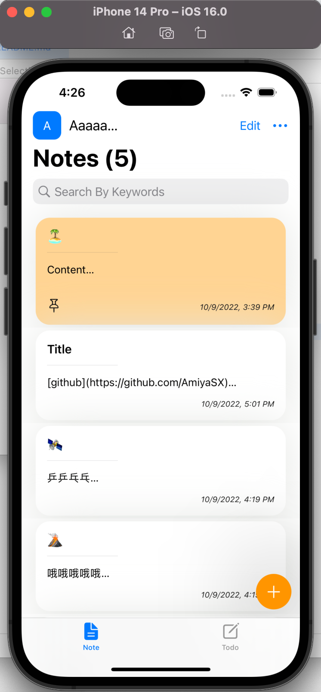
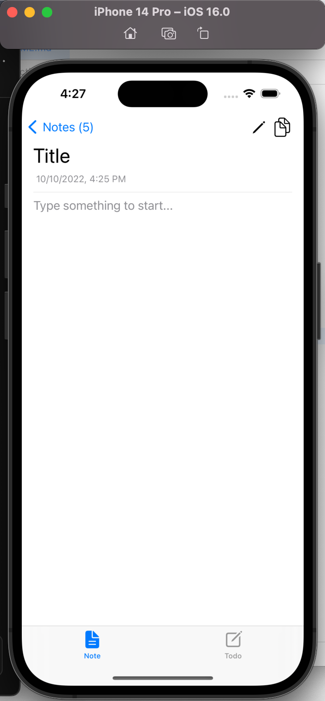
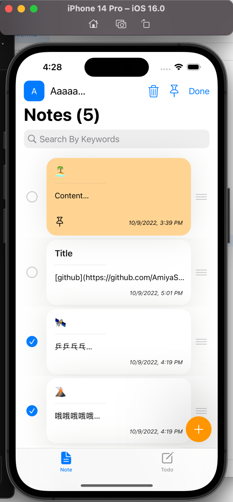
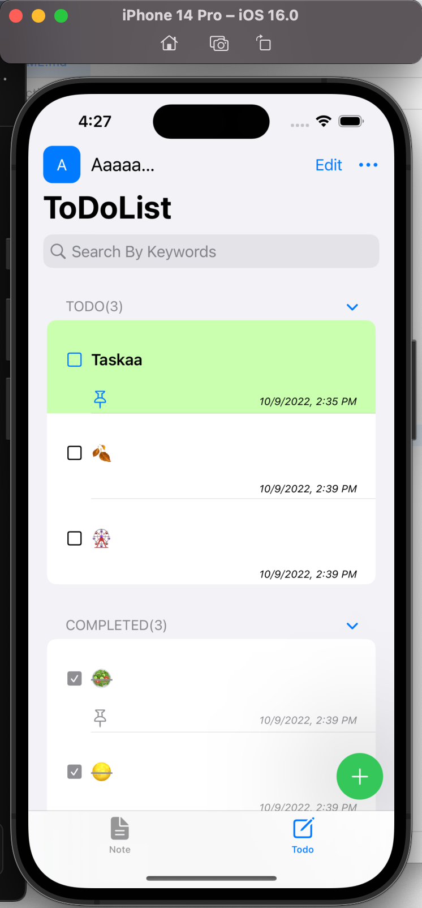
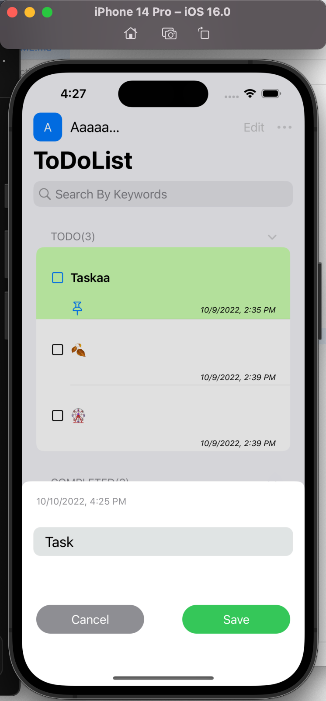
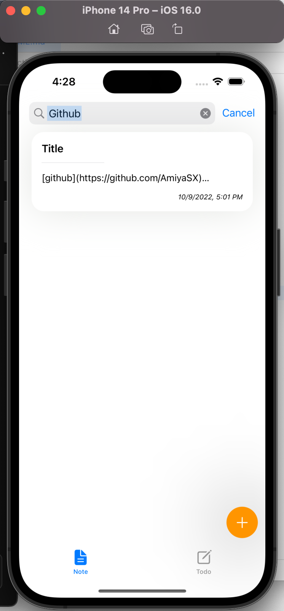
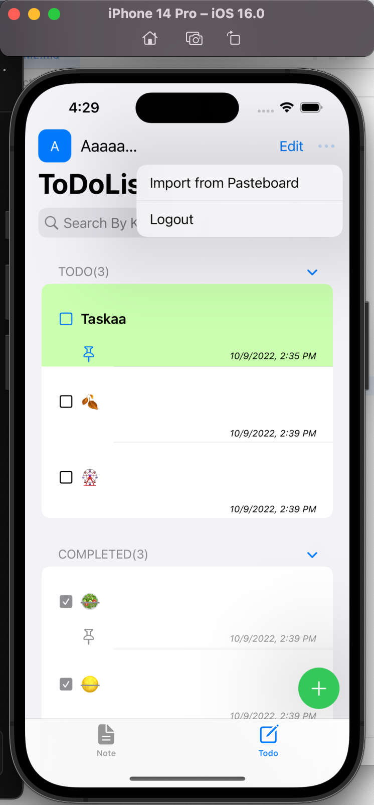

# NotePad
Pivot Studio iOS 任务

## 完成基础要求
- 可编辑、添加删除
- 可多选删除、置顶
- 便签可移动，⼿动排序
- 待办事项完成⾃动置后
- 数据本地持久化

## 完成进阶功能
- 登录功能，账户管理
- 搜索框搜索便签内关键词
- 通过剪切板批量导入便签
- 内容的显示支持markdown格式(图片显示同理)

## Begin With
```shell
pod install
```

## Images
1.NoteView \n


添加Note: \n


多选置顶、删除：\n


2.TaskView \n


添加Task: \n


3.搜索功能 \n


4.其他 \n


